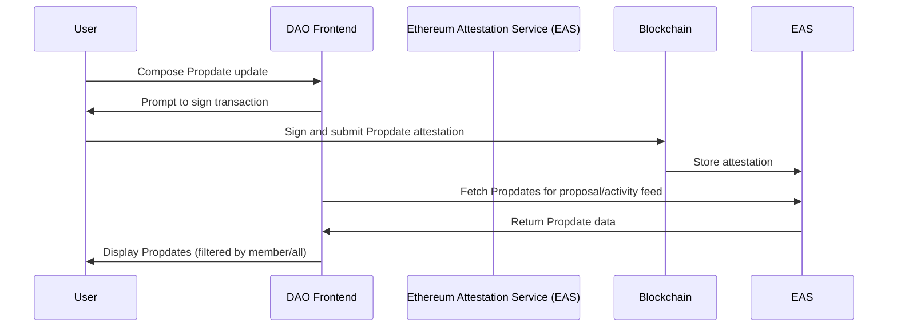

---
sidebar:
  order: 4
title: Propdate EAS Schema
---

## Overview

This schema defines how users of Nouns Builder can submit *Propdates*, i.e., *updates*, *comments*, and *milestone-related actions*, to DAO proposals using the [Ethereum Attestation Service (EAS)](https://docs.attest.org).
All attestations using this schema are displayed under the **Propdates** section of the proposal UI. It supports Markdown, IPFS links, structured JSON, and threaded discussions via reply references.

## Sequence Diagram




## Schema Specification

The schema with the UID `0x8bd0d42901ce3cd9898dbea6ae2fbf1e796ef0923e7cbb0a1cecac2e42d47cb3` enables Nouns Builder Propdates. It is deployed onchain on all networks supported by Nouns Builder **except Zora**. The schema consists of mandatory and optional fields. The payload displayed on the frontend is wrapped in a `message` field, which MAY contain a *JSON* string.

### Deployed Schemas

- [Base](https://base.easscan.org/schema/view/0x8bd0d42901ce3cd9898dbea6ae2fbf1e796ef0923e7cbb0a1cecac2e42d47cb3),
- Zora Mainnet **(not supported)**
- [OP Mainnet](https://optimism.easscan.org/schema/view/0x8bd0d42901ce3cd9898dbea6ae2fbf1e796ef0923e7cbb0a1cecac2e42d47cb3),
- [Ethereum Mainnet](https://easscan.org/schema/view/0x8bd0d42901ce3cd9898dbea6ae2fbf1e796ef0923e7cbb0a1cecac2e42d47cb3),
- [Base Sepolia](https://base-sepolia.easscan.org/schema/view/0x8bd0d42901ce3cd9898dbea6ae2fbf1e796ef0923e7cbb0a1cecac2e42d47cb3),
- [OP Sepolia](https://optimism-sepolia.easscan.org/schema/view/0x8bd0d42901ce3cd9898dbea6ae2fbf1e796ef0923e7cbb0a1cecac2e42d47cb3),
- Zora Sepolia **(not supported)**
- [Ethereum Sepolia](https://sepolia.easscan.org/schema/view/0x8bd0d42901ce3cd9898dbea6ae2fbf1e796ef0923e7cbb0a1cecac2e42d47cb3)

### Schema Structure

```solidity
bytes32 proposalId;
bytes32 originalMessageId;
uint8 messageType;      // 0: INLINE_TEXT, 1: INLINE_JSON, 2: URL_TEXT, 3: URL_JSON
string message;         // Inline content or off-chain URL
```

### Field Breakdown

| Field               | Type      | Description |
|---------------------|-----------|-------------|
| `proposalId`        | `bytes32` | Proposal ID (usually keccak256 of the proposal metadata or ID hash) |
| `originalMessageId` | `bytes32` | UID of another attestation being replied to. Use `0x0` for top-level comments. |
| `messageType`       | `uint8`   | Specifies how to interpret `message`. See types below. |
| `message`           | `string`  | Inline content (if `INLINE_*`) or a URL (e.g., IPFS) if `URL_*` |


### Message Type Definition

| Code | Name          | Description                                        |
|------|---------------|----------------------------------------------------|
| `0`  | `INLINE_TEXT` | Raw Markdown string submitted inline               |
| `1`  | `INLINE_JSON` | JSON payload embedded directly in the attestation  |
| `2`  | `URL_TEXT`    | URL (e.g., IPFS) pointing to a Markdown file       |
| `3`  | `URL_JSON`    | URL (e.g., IPFS) pointing to a JSON file           |

---

### JSON Payload (For `INLINE_JSON` or `URL_JSON`)

```json
{
  "milestoneId": 2,
  "content": "Delivered frontend with tests.",
  "labels": ["delivery", "frontend"],
  "attachments": ["ipfs://bafybeigdyrhnsq.../demo.mp4"]
}
```

### JSON Field Reference

| Field         | Type       | Description                                             |
|---------------|------------|---------------------------------------------------------|
| `milestoneId` | `number`   | [Optional] Milestone index the update refers to         |
| `content`     | `string`   | [**Required**] text content                             |
| `labels`      | `string[]` | [Optional] Tags for filtering/search                    |
| `attachments` | `string[]` | [Optional] List of media or file URLs (preferably IPFS) |


## Usage

### Example Attestation

[View on EASScan](https://base.easscan.org/attestation/view/0xf1c43e68c96c29831af1760979b3c7f52abfb14561434381a5983f356c2f9ab8)

```json
{
  "proposalId": "0x20dce33aa50446e11ad5e97321f50e98c5d4fa41b0cfa87b5a525a6d1100fc4b",
  "originalMessageId": "0x0000000000000000000000000000000000000000000000000000000000000000",
  "messageType": 1,
  "message": "{\"milestoneId\":1,\"content\":\"Milestone 1 complete. All Figma wireframes uploaded.\",\"labels\":[\"figma\",\"ux\"],\"attachments\":[\"ipfs://bafybeihpky3lq4m/demo.mp4\"]}"
}
```
### Workflow for Non-UI Propdates

1. **Create attestation**  
    A wallet with authority can submit an attestation directly through [EAS](https://base.easscan.org/) using the schema UID.

2. **Fetch and display attestations**  
    Fetch the schema on the relevant network using EAS Scan and the Schema UID. Connect your wallet and post an update.

3. **Propdates versus release requests**
    Release request must be made independently of updates and comments, using the `Release Milestone` functionality, as described in the [Nouns Builder Escrow Proposal Guide](../guides/builder-escrow-proposal.mdx)

### Usage in Nouns Builder Frontend

- Appears in the **Propdates** tab on the proposal page.
- Posts by DAO members are shown by default, but anyone can:
  - Post progress updates
  - Comment on milestones
  - Start threaded conversations

## Attestation Policy and Deploying Schemas

Only attestations from DAO members are displayed under **Propdates** by default, but users can select **All Propdates** to see non-member comments.

The attestation schema can be deployed to additional networks using the same UID by anyone.

