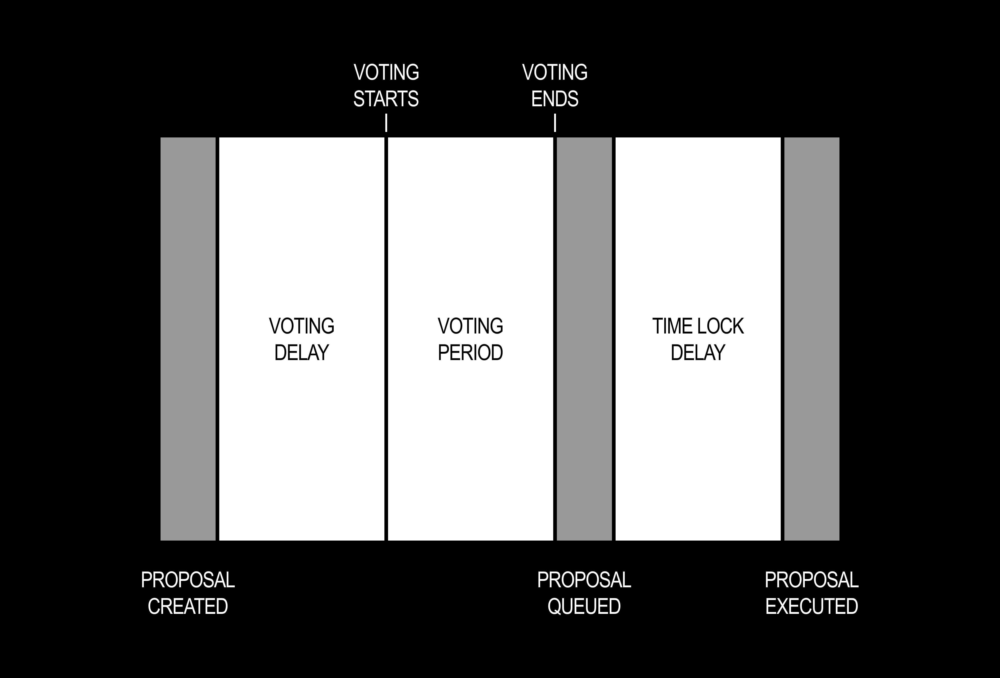

---
sidebar:
  order: 2
title: Proposals and Voting
---


##### Creating a Proposal, Voting, and Vetoing
---

The Governance contract is in charge of maintaining order within the DAO. 
It keeps a record of proposals and votes.
While the Treasury contract is in charge of holding DAO funds and executing transactions for passed proposals.

- `Proposal Threshold:` Min [BPS](https://www.investopedia.com/terms/b/basispoint.asp) of total votes (NFTs) needed to put a proposal to a vote.
For example, if the Proposal Threshold is set to 100 BPS and there are 500 total NFTs minted then 5 NFTs need to approve the proposal for it to go to a vote.
- `Quorum Threshold:` Min BPS of total **For** votes (NFTs) required for a proposal to pass
- `Voting Delay:` The amount of time before a proposal can start voting in seconds.
- `Voting Period:` The duration for voting on a proposal in seconds.
- `Time Lock Delay:` The amount of time a successful proposal must wait between being queued and executed.

## Which Governor Behaviour Applies?

Builder DAOs do not all use the same Governor implementation. Contract upgrades are optional and controlled by each DAO, so the correct lifecycle and ABI depend on that DAO's contracts and configuration.

| DAO configuration | First proposal state | Can proposals be updated? | Signing interface |
|---|---|---|---|
| **Original Governor contracts** | Pending | No | Original vote-signature ABI |
| **Upgraded Governor, update period set to `0`** | Pending | No | Upgraded ABI and revision reads are available, but updates are disabled |
| **Upgraded Governor, update period greater than `0`** | Updatable | Yes, during the fixed update period | Upgraded ABI and proposal-update functions |

Upgrading an existing Governor does not rerun its initializer. A DAO upgrading from a contract without the new storage slot therefore begins with `proposalUpdatablePeriod == 0`. Its proposals continue to follow the original lifecycle until the DAO separately enables an update period through governance.

:::note

Do not infer the Governor version from the nouns.build interface alone. Read the DAO's contract version and `proposalUpdatablePeriod()` before building an integration or preparing an upgrade.

:::

The upgraded implementation and its design documentation are available in the protocol branch:

- [Governor implementation](https://github.com/BuilderOSS/nouns-protocol/blob/feat/updatable-proposals/src/governance/governor/Governor.sol)
- [Governor interface](https://github.com/BuilderOSS/nouns-protocol/blob/feat/updatable-proposals/src/governance/governor/IGovernor.sol)
- [Proposal lifecycle reference](https://github.com/BuilderOSS/nouns-protocol/blob/feat/updatable-proposals/docs/governor-proposal-lifecycle.md)
- [Governor architecture](https://github.com/BuilderOSS/nouns-protocol/blob/feat/updatable-proposals/docs/governor-architecture.md)
- [Upgrade runbook](https://github.com/BuilderOSS/nouns-protocol/blob/feat/updatable-proposals/docs/upgrade-runbook.md)

---

### Original or Update-Disabled Proposal Lifecycle
- A proposal is submitted to the DAO on-chain by an address that owns enough NFTs to clear the Proposal Threshold.
- The proposal can't be voted on until after the voting delay time has passed.
- Once the delay period has passed, the proposal must then receive more **For** votes than **Against** and the number of **For** votes must meet or exceed the Quorum Threshold.
- Finally, if the voting period has finished and it has received enough **For** votes then the proposed transaction is queued for execution.
- Then the proposal must pass the Time Lock Delay which defaults to 2 days.
- Finally, once the time lock has ended the proposal is then executed.




### Proposal Stages In Depth

The original Governor enum remains the correct reference for DAOs that have not upgraded:

```ts
export enum ProposalState {
  Pending = 0,     // Created, waiting for voting delay to pass
  Active = 1,      // Open for voting
  Canceled = 2,    // Canceled by proposer or admin
  Defeated = 3,    // Voting ended without reaching quorum or For majority
  Succeeded = 4,   // Passed quorum and received majority For votes
  Queued = 5,      // Scheduled for execution after timelock delay
  Expired = 6,     // Was queued but not executed within grace period (14 days)
  Executed = 7,    // Executed on-chain successfully
  Vetoed = 8       // Vetoed by an address with veto rights
}
```

The upgraded Governor appends two states without changing the numeric values of the original states:

```ts
export enum UpgradedProposalState {
  Pending = 0,
  Active = 1,
  Canceled = 2,
  Defeated = 3,
  Succeeded = 4,
  Queued = 5,
  Expired = 6,
  Executed = 7,
  Vetoed = 8,
  Updatable = 9,   // Editable during the configured update period
  Replaced = 10    // An earlier revision superseded by a new proposal ID
}
```

When the upgraded Governor's update period is enabled, the lifecycle begins:

```text
Updatable → Pending → Active
```

It then follows the same voting, queuing and execution outcomes as the original Governor. An update creates a new proposal ID and marks the preceding revision **Replaced**. It preserves the original update deadline, vote start, vote end and voting-power snapshot.

The lifecycle of a proposal generally follows:

**1. Pending:** Proposal submitted, but voting has not started (waiting for Voting Delay).

**2. Active:** Voting is open for the duration of the Voting Period.

**3. Succeeded:** If quorum and majority **For** are met, the proposal moves to Queued.

**4. Queued:** Proposal is in the queue and must wait for Time Lock Delay, e.g., 2 days.

**5. Grace Period:** After timelock, there's a 14-day window in which the proposal can be executed or vetoed.

**6. Executed:** If executed within the grace period, the proposal is marked as Executed.

**7. Expired:** If not executed within the 14-day grace period, it transitions to Expired and can no longer be executed.

:::note
Proposals can be vetoed at any stage of the proposal process until executed.

**You can view the specific settings, e.g., Voting Delay, Voting Period, Timelock for *your DAO* in the Admin Panel.**
:::

---

## Min and Max Values
As a precaution, Nouns Builder has put guards in place to make sure that governance can't set voting parameters to unreasonable values.
Listed below are the min and max values possible for each governance parameter.

##### Proposal Threshold 
- `MIN_PROPOSAL_THRESHOLD_BPS:` 1
- `MAX_PROPOSAL_THRESHOLD_BPS:` 1000

##### Quorum Threshold 
- `MIN_QUORUM_THRESHOLD_BPS:` 200
- `MAX_QUORUM_THRESHOLD_BPS:` 2000  

##### Voting Delay
- `MIN_VOTING_DELAY:` 1 seconds
- `MAX_VOTING_DELAY:` 24 weeks

##### Voting Period
- `MIN_VOTING_PERIOD:` 10 minutes
- `MAX_VOTING_PERIOD:` 24 weeks

## Proposing
Anyone can create a proposal, however, the proposal needs to have a certain number of NFTs backing it (Proposal Threshold) before it is put to a vote.
```
/// @param _targets The target addresses to call
/// @param _values The ETH values of each call
/// @param _calldatas The calldata of each call
/// @param _description The proposal description
function propose(
    address[] memory _targets,
    uint256[] memory _values,
    bytes[] memory _calldatas,
    string memory _description
) external returns (bytes32)
```
---

## Voting
Once a proposal has received enough backing to surpass the Proposal Threshold and enough time has passed for the Voting Delay, then the voting process can begin.
There are different ways to cast a vote for a proposal.

Note, the Token contract checkpoints the timestamp every time the NFT is transferred.
As a result, an NFT is not able to vote on a proposal if it has been transferred after the proposal was created. 

#### castVote
```
/// @param _proposalId The proposal id
/// @param _support The support value (0 = Against, 1 = For, 2 = Abstain)
function castVote(bytes32 _proposalId, uint256 _support) external returns (uint256) {
    return _castVote(_proposalId, msg.sender, _support, "");
}
```

#### castVoteWithReason
```
/// @notice Casts a vote with a reason
/// @param _proposalId The proposal id
/// @param _support The support value (0 = Against, 1 = For, 2 = Abstain)
/// @param _reason The vote reason
function castVoteWithReason(
    bytes32 _proposalId,
    uint256 _support,
    string memory _reason
) external returns (uint256)
```

#### Original `castVoteBySig`

The following ABI applies to the original Governor contracts:

```
/// @notice Casts a signed vote
/// @param _voter The voter address
/// @param _proposalId The proposal id
/// @param _support The support value (0 = Against, 1 = For, 2 = Abstain)
/// @param _deadline The signature deadline
/// @param _v The 129th byte and chain id of the signature
/// @param _r The first 64 bytes of the signature
/// @param _s Bytes 64-128 of the signature
function castVoteBySig(
    address _voter,
    bytes32 _proposalId,
    uint256 _support,
    uint256 _deadline,
    uint8 _v,
    bytes32 _r,
    bytes32 _s
) external returns (uint256)
```

#### Upgraded `castVoteBySig`

The upgraded Governor adds an explicit nonce and accepts the complete signature as `bytes`:

```solidity
function castVoteBySig(
    address _voter,
    bytes32 _proposalId,
    uint256 _support,
    uint256 _nonce,
    uint256 _deadline,
    bytes calldata _sig
) external returns (uint256)
```

The upgraded contract source describes this as the V2 to V3 signing change. The upgrade runbook describes the associated release as Governor 2.0.0 to 2.1.0. Regardless of release-label conventions, the ABIs and EIP-712 type hashes are incompatible: signatures produced for the original interface cannot be reused after the upgrade.

---

## Executing a Proposal
If a proposal has received a majority For vote and has passed the Quorum Threshold it can be executed on-chain.
The execute function is called on the Governance contract, but forwards the calldata to the Treasury contract.
```
/// @param _targets The target addresses to call
/// @param _values The ETH values of each call
/// @param _calldatas The calldata of each call
/// @param _descriptionHash The hash of the description
/// @param _proposer The proposal creator
function execute(
    address[] calldata _targets,
    uint256[] calldata _values,
    bytes[] calldata _calldatas,
    bytes32 _descriptionHash,
    address _proposer
) external payable returns (bytes32)
```

---

## Delegation
The Token contract allows holders to be able to delegate their voting power to another address.
Note, on transfer the Token contract resets all delegation records.

#### delegate
```
/// @notice Delegates votes to an account
/// @param _to The address delegating votes to
function delegate(address _to) external
```

#### delegateBySig
```
/// @notice Delegates votes from a signer to an account
/// @param _from The address delegating votes from
/// @param _to The address delegating votes to
/// @param _deadline The signature deadline
/// @param _v The 129th byte and chain id of the signature
/// @param _r The first 64 bytes of the signature
/// @param _s Bytes 64-128 of the signature
function delegateBySig(
    address _from,
    address _to,
    uint256 _deadline,
    uint8 _v,
    bytes32 _r,
    bytes32 _s
) external
```

---

## Vetoing
Vetoing is an optional setting that can be configured by the founders when deploying.
Note, veto power is encouraged due to the small number of votes (NFTs) at the beginning of a DAO.
The veto can later be removed by the founders once the NFTs have become sufficiently decentralised.

#### Vetoing Proposal
```
/// @notice Vetoes a proposal
/// @param _proposalId The proposal id
function veto(bytes32 _proposalId) external
```

#### Updating and Removing Veto
```
/// @notice Updates the vetoer
/// @param newVetoer The new vetoer address
function updateVetoer(address newVetoer) external;

/// @notice Burns the vetoer
function burnVetoer() external;
```
