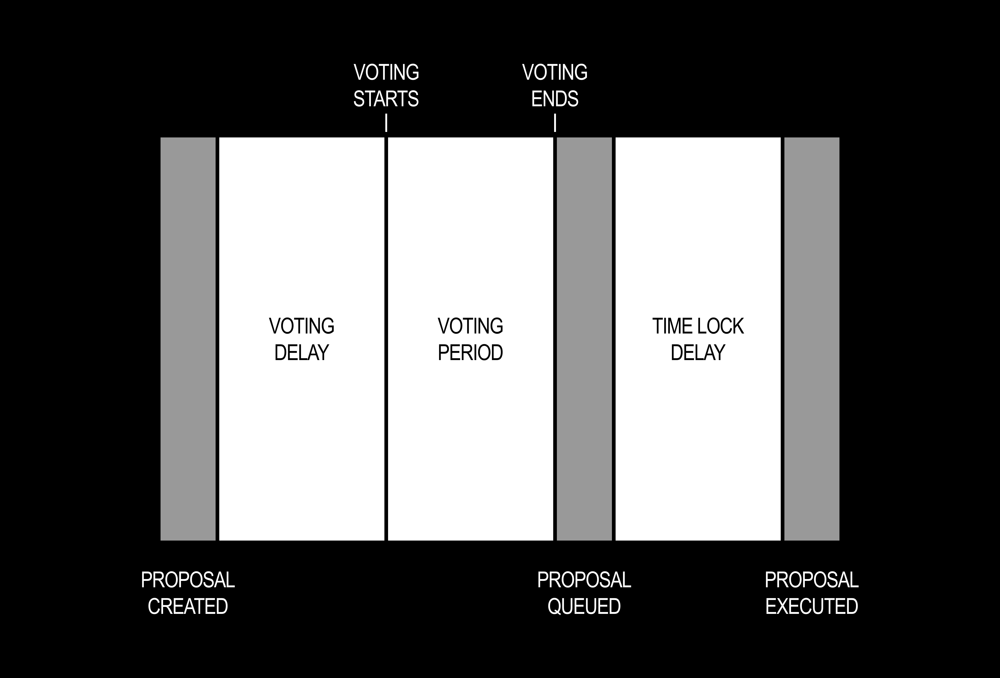

---
sidebar:
  order: 13
id: builder-proposal
title: How to Create a Proposal
---

##### Learn how to submit a governance proposal in your DAO

Proposals are the core mechanism of DAO governance. Any token holder who meets the Proposal Threshold can submit a proposal — and if it passes a vote, the DAO will execute whatever transactions you've attached to it automatically.

The proposal flow is split into three steps: write your proposal, add transactions, then review and submit on-chain.

:::note

To follow along safely before going to mainnet, use the [Sepolia Testnet](https://testnet.nouns.build/). You'll need a governance token for the DAO you want to propose in. Your wallet must hold enough tokens to meet the DAO's Proposal Threshold.

:::

## Key Terms

- `Proposal Threshold:` The minimum number of governance tokens (as a percentage of total supply) required to submit a proposal. For example, if the threshold is 1% and 500 tokens have been minted, you'll need at least 5 tokens.
- `Quorum Threshold:` The minimum number of **For** votes required for a proposal to pass.
- `Voting Delay:` The time between a proposal being submitted and voting opening, in seconds.
- `Voting Period:` How long voting remains open, in seconds.
- `Time Lock Delay:` The waiting period between a successful vote being queued and the transaction being executed. Defaults to 2 days.

## Proposal Lifecycle

Once submitted, a proposal moves through the following stages:

1. **Pending** — The proposal is on-chain but voting hasn't started yet (Voting Delay is active).
2. **Active** — Voting is open. Token holders cast For, Against, or Abstain votes.
3. **Succeeded / Defeated** — Voting closes. The proposal passes if For votes exceed Against votes and meet the Quorum Threshold. Otherwise it's defeated.
4. **Queued** — A successful proposal enters the time lock queue.
5. **Executed** — After the Time Lock Delay, anyone can trigger execution. The DAO's treasury carries out the attached transactions.

## Creating a Proposal

Navigate to your DAO's **Activity** tab and click **Create proposal**.

The proposal builder opens at Step 1. A progress indicator at the top of the page shows all three steps throughout the flow.

:::note

**First time?** A tip banner at the top of the page summarises the flow: write the proposal, add transactions, then do a final preflight before submitting. Click **Got it** to dismiss it.

:::

## Step 1: Write Proposal

Fill in the two fields:

- **Title** — A concise, descriptive name for your proposal. This is what token holders will see in the proposals list.
- **Description** — The full proposal write-up. The editor supports Markdown: use the toolbar for headings, bold, italic, links, code blocks, images, and lists. You can also drag and drop files into the description area to attach them.

Once both fields are complete, click **Continue** to move to Step 2.

### Optional Fields

Beyond the title and description, Step 1 exposes two optional fields that are worth knowing about.

#### Discussion URL

Paste a link to any off-chain discussion thread related to the proposal — a governance forum post, a Farcaster cast, a Discord thread, or similar. This gives voters context without cluttering the on-chain description. Please refrain from adding IPFS URLs.

#### Submitting on Behalf of Someone Else

If you are submitting a proposal on behalf of another token holder, check the **Are you submitting this proposal on behalf of someone else?** box. An address field will appear — enter the proposer's wallet address (`0x…`) or ENS name. The proposal will be attributed to that address on-chain in the proposal metadata.

:::note

The wallet you connect with must still meet the DAO's Proposal Threshold. The on-behalf-of field adds data on the attributed proposer in the proposal metadata but does not delegate voting power.

:::

## Step 2: Add Transactions

Transactions define what the DAO actually *does* if the proposal passes. You need to queue at least one transaction to proceed. The header shows a running count of transactions queued.

### Selecting a Transaction Type

Use the **Select transaction type** dropdown to choose from the available options:

| Transaction Type | Description |
|---|---|
| **Send Tokens** | Send ETH or ERC-20 tokens from the treasury to one or more recipients |
| **Send NFTs** | Send NFTs from the treasury |
| [**Stream Tokens**](/guides/sablier-proposal.mdx) | Set up continuous token payments over time (powered by Sablier) |
| [**Airdrop Tokens**](/guides/sablier-proposal.mdx) | Distribute tokens via Sablier merkle campaigns |
| [**Milestone Payments**](/guides/builder-escrow-proposal.mdx) | Schedule token releases tied to milestones |
| [**Mint Governance Tokens**](/guides/mint_gov_tokens.mdx) | Mint governance tokens to specific addresses |
| **WalletConnect** | Connect to a dApp and execute transactions via WalletConnect |
| [**Nominate Delegate**](/guides/builder-escrow-proposal.mdx) | Nominate a delegate for milestone payments or token streams |
| **Pin Treasury Asset** | Whitelist a token or NFT for prominent display in the treasury |
| **Custom Transaction** | Any other contract call — paste an ABI and select a function |
| [**Coining**](/guides/coining.mdx) | Create a proposal to mint a Content or DAO Coin |
| [**Droposal: Single Edition**](/guides/droposals.mdx) | Create a single-edition ERC-721 collection droposal |
| [**Pause Auctions**](/guides/auctions.mdx) | Pause DAO auctions |
| [**Add Artwork**](/guides/artworks.mdx) | Add new artwork layers to your DAO's NFT collection |
| [**Replace Artwork**](/guides/artworks.mdx) | Replace an existing artwork layer in your collection |

**Once you added the transaction details, you can add it to the queue.**

### Example: Sending Tokens

Select **Send Tokens** to send ETH or an ERC-20 token from the treasury.

**If you want to reset your progress, follow the red arrows above. You will have to confirm to reset your progress.**

1. Choose a token from the **Select a token** dropdown (ETH or any ERC-20 held by the treasury).
2. Enter the recipient address and amount. Use the **Number of Recipients** control to add multiple recipients in a single transaction.
3. Click **Add Transaction to Queue**.

The transaction appears in the queue. You can add multiple transactions of different types to a single proposal — they'll all execute together if the proposal passes.

### Updating DAO Settings via a Proposal

If you want to change a governance parameter (auction duration, voting period, quorum, and so on), you don't need a custom transaction. Use the **Configure DAO Settings** shortcut at the bottom of the page — this takes you directly to the Admin tab where settings changes are automatically encoded as proposal transactions.

Once you've queued all your transactions, click **Continue**.

## Step 3: Review and Submit

The final step gives you a full summary of everything before it goes on-chain:

- **Proposal title and description** — review for accuracy.
- **Transaction list** — confirm each transaction, the target addresses, and amounts.
- **Simulation results** — the interface runs a simulation of your transactions so you can catch any execution errors before spending gas.
- **Governance timeline** — a projected timeline showing when voting will open and close, and when the proposal could be executed if it passes.

If anything looks wrong, use the **←** back button to return to the previous step and make changes. The draft is preserved.

When you're satisfied, click **Submit proposal**. Your wallet will prompt you to sign and broadcast the on-chain transaction.

:::note

Your wallet must hold enough governance tokens to meet the Proposal Threshold at the moment of submission. If you don't meet the threshold, the transaction will revert.

:::

Once the transaction confirms, the proposal will appear in your DAO's **Activity** tab with a **Pending** status. It will move to **Active** once the Voting Delay period has elapsed.

